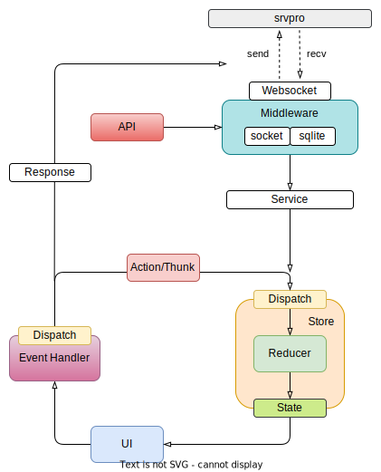

import Tabs from '@theme/Tabs';
import TabItem from '@theme/TabItem';

# 架构设计
本章将会介绍Neos的整体架构设计。

## UI层设计
整体基于[Redux框架](https://redux.js.org)采用UI与数据解耦的设计，UI层通过`useAppSelector`获取`Store`中的状态进行渲染，当状态发生改变时，自动触发UI更新。

目前决斗界面可以整体分为两部分：
1. Canvas元素：基于[Babylon.js框架](https://www.babylonjs.com)进行`WebGL`渲染，主要负责展示**决斗盘，游戏王卡片还有动画（TODO）**
2. 其他HTML元素：基于[Ant Design](https://ant.design/components/overview-cn)实现了一些布局，弹窗还有交互按钮的渲染，主要负责**卡片详细内容（比如卡片效果，ATK，超量素材等）和玩家交互（连锁提示，融合/同调/超量/链接素材选择，指示器选择等）**的展示

## 数据层设计
状态数据整体放在`Redux框架`的`Store`结构里面，提供了一些`Reducer` API，外层通过`dispatch`调用这些API来更新状态。

目前`Store`的数据来源有两个：
1. 玩家行为 - 玩家的点击或其他交互会触发本地状态的更新
2. 后端数据 - 后端通过[Websocket](https://developer.mozilla.org/en-US/docs/Web/API/WebSocket)给前端推送数据后，会经过`Service`模块更新本地状态

:::note
举个🌰：当场上有怪兽通招/特招时，后端会推送一个`MSG_MOVE`的数据到前端，然后`Service`模块从后端数据中提取出`xxx怪兽移动到xxx位置`的信息，然后基于该信息调用`dispatch`更新本地状态，同时状态的更新自动触发UI层重新渲染。
:::note

## 各模块对应代码位置
<Tabs
  defaultValue="ui"
  values={[
    {label: 'UI', value: 'ui'},
    {label: 'Reducer', value: 'reducer'},
    {label: 'Service', value: 'service'},
    {label: 'Middleware', value: 'middleware'},
    {label: 'API', value: 'api'},
  ]}>
  <TabItem value="ui">neos-ts/src/ui</TabItem>
  <TabItem value="reducer">neos-ts/src/reducers</TabItem>
  <TabItem value="service">neos-ts/src/service</TabItem>
  <TabItem value="middleware">neos-ts/src/middleware</TabItem>
  <TabItem value="api">neos-ts/src/api</TabItem>
</Tabs>

## Q&A
1. **为什么选择使用Babylon.js？**
> 在Web平台上比较成熟的`WebGL`框架目前只有两个：[Three.js](https://threejs.org/)和[Babylon.js](https://www.babylonjs.com)。前者更加成熟，用户量更多，生态也更庞大；后者起步较晚，但是在短时间内也有了不小的用户群体和社区（19.8k star + 3.6k used），它更加底层，更加灵活，历史包裹较少。同时后者原生基于Typescript实现，比较容易集成到我们项目里面。

2. **为什么没有实现动画？**
> 因为目前没找到很优雅的实现动画的解决方案。目前我们的项目整体是基于`React`+`Redux`的单向数据流方案，UI层只管渲染新状态，不感知从旧状态到新状态的变化，而动画效果正好是需要感知变化的。目前找到一个比较好的方案是[Spring框架](https://www.react-spring.dev)，但是尝试集成到Neos项目中后发现没有效果，猜测是`Spring`和`Babylon.js`配合得不是很好。
