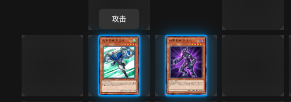

# 决斗
本节将主要介绍`neos`的决斗界面和一些基础操作。

### 决斗界面

### 召唤/发动效果

### 阶段切换
点击右下角的按钮可以切换到战斗阶段，主要阶段2，或者结束回合。

### 攻击操作

### 连锁操作

### 提示
游戏中的一些提示，比如选择召唤的区域，会在左上角弹窗提示。

### 胜负
游戏结束时，会在屏幕下方显示对局结果，并会在`5s`后，自动跳转到登陆界面。

:::note
保存回放暂时还不支持，敬请期待。
:::note
