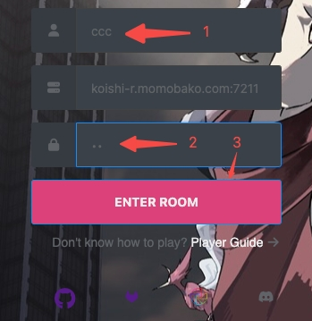

# 加入房间

进入[Neos页面](https://neos.moecube.com)后，页面中间会出现三个输入框:
1. 玩家名称
2. 服务器地址
3. 房间密码

`玩家名称`输入自己喜欢的名字即可。

`服务器地址`已经输入了一个默认的萌卡官方提供的地址，如果想连接其他服务器或者本地局域网游玩，可以按照`IP:端口`的格式输入。

`房间密码`和ygopro里面的房间密码含义一致，可以参考[233服](https://ygo233.com/usage)的解释。一般直接随便输入即可。如果想和人机对战的话房间密码输入`AI`即可。

