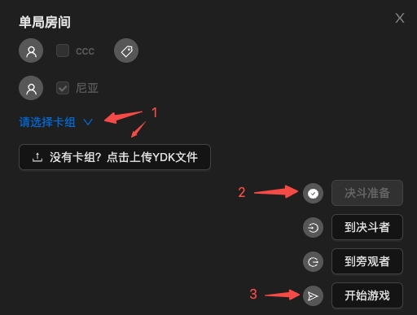

# 等待房间

成功加入房间后，玩家目前可以通过两种方式来选择卡组：
1. 点击下拉菜单选择推荐的预设卡组
2. 通过上传`YDK`文件来添加卡组

> 上传`YDK`文件成功后会有弹窗提示`YDK文件解析成功`，这时候您上传的卡组就会设定为对局中使用的卡组，不需要再访问下拉菜单来选择卡组。

选择完卡组后，点击`决斗准备`按钮可以完成准备；等双方都准备完毕后，房主可以点击`开始游戏`开启对局。

